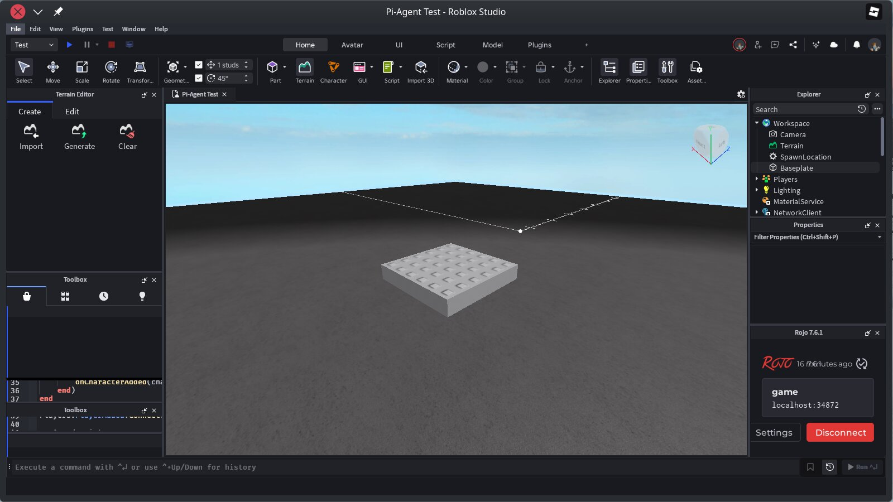
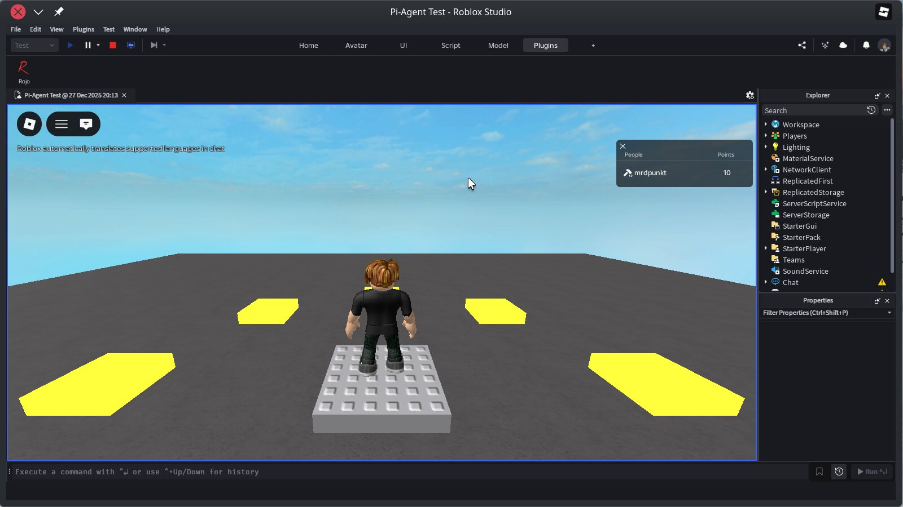

# 🎮 Roblox Pi-Coding-Agent Template

Build Roblox games by talking to an AI. Describe what you want, and [pi-coding-agent](https://shittycodingagent.ai/) writes the code. ✨

## 🚀 See It in Action

You start with a simple world - just a baseplate and spawn point:



Tell pi what you want:

```
Add 8 lava parts in a circle around the spawn point
```

Pi writes a script, it syncs to Studio, and lava appears:



Want more? Just ask:

```
Make the lava parts rotate around spawn, and make the circle grow and shrink
```

Now you have orbiting, pulsating lava:


The code is in your project, ready to customize.

## 📦 Getting Started

### 1. Prerequisites

- [pi-coding-agent](https://shittycodingagent.ai/) - the AI coding assistant that writes your game code
  ```bash
  # Install with npm
  npm install -g @mariozechner/pi-coding-agent
  
  # Or with mise
  mise use -g npm:@mariozechner/pi-coding-agent
  ```
- **Roblox Studio** - where your game runs
  - **Linux:** Install via [Vinegar](https://github.com/vinegarhq/vinegar): `flatpak install flathub org.vinegarhq.Vinegar`
  - **Windows/Mac:** Download from [roblox.com/create](https://www.roblox.com/create)

### 2. Setup

Clone this template and install the tools:

```bash
git clone https://github.com/dnouri/roblox-pi-template my-game
cd my-game
make setup
```

This downloads several tools:
- [Rojo](https://rojo.space/) - syncs code from your editor to Studio in real-time
- [Selene](https://kampfkarren.github.io/selene/) - checks your code for errors
- [StyLua](https://github.com/JohnnyMorganz/StyLua) - formats your code consistently
- [rbxcloud](https://github.com/Sleitnick/rbxcloud) - publishes your game to Roblox

It also installs the Rojo plugin into Studio so they can talk to each other.

### 3. Start Building

First, start the sync server. This watches your code files and pushes changes to Studio:

```bash
make serve
```

Next, open Studio:

```bash
# Linux
flatpak run org.vinegarhq.Vinegar studio

# Windows/Mac - just open Roblox Studio normally
```

Connect Studio to the sync server: go to **Plugins tab → Rojo → Connect**. You should see the baseplate and spawn point appear.

**Verify everything works:** Run `make verify` to check that tools are installed and Studio is connected.

Now start pi and tell it what to build!

## ⚙️ How It Works

You describe what you want in plain English. Pi writes Luau scripts (Roblox's programming language) in the `src/` folder. Rojo syncs them to Studio automatically.

```
src/
├── server/     → runs on Roblox servers (game logic, scoring)
├── client/     → runs on player's device (UI, input)
└── shared/     → shared code (used by both)
```

Your code is saved to files and tracked in git - real code you can edit by hand, share with others, and publish to Roblox.

### Included Examples

The template comes with two working scripts:

- **DeadlyLava** - Any part named "Lava" kills players on touch
- **ScorePoints** - Leaderboard showing points per second alive

Press F5 in Studio to play-test. You'll see the leaderboard counting up. Touch lava and you die (score resets).

## 🔍 Live Debugging

Sometimes you want to inspect or experiment without writing files. Start the MCP server:

```bash
make mcp-start
```

In Studio, click the **MCP** button in the Plugins tab. Now you can ask pi things like:

```
What parts are in the workspace?
What's the player's current position?
```

These queries run directly in Studio. Useful for debugging, but changes don't save - for permanent code, pi writes to `src/`.

## 🌐 Publishing Your Game

Set up your credentials once:

```bash
cp .env.example .env
# Edit .env with your API key and IDs (pi can help you find them!)
```

Then publish:

```bash
make publish
```

### Uploading Assets

To upload images or sounds to Roblox, ask pi:

```
Upload the image assets/icon.png to Roblox
```

Pi uses [rbxcloud](https://github.com/Sleitnick/rbxcloud) to upload assets and gives you the asset ID to use in your scripts.

## 📋 Commands Reference

| Command | Description |
|---------|-------------|
| `make setup` | Download tools + install plugins |
| `make serve` | Start Rojo live sync |
| `make build` | Build .rbxl file |
| `make publish` | Publish to Roblox |
| `make verify` | Check setup status |
| `make lint` | Check code with Selene |
| `make format` | Format code with StyLua |
| `make mcp-start` | Start MCP server for live debugging |
| `make mcp-stop` | Stop MCP server |
| `make setup-docs` | Download Roblox API docs |
| `make setup-hooks` | Install pre-commit linting |

## 🛠️ Tools Included

| Tool | Purpose |
|------|---------|
| [Rojo](https://rojo.space/) | Syncs code to Studio |
| [Selene](https://kampfkarren.github.io/selene/) | Luau linter |
| [StyLua](https://github.com/JohnnyMorganz/StyLua) | Luau formatter |
| [rbxcloud](https://github.com/Sleitnick/rbxcloud) | Publishing + asset uploads |
| [Lune](https://lune-org.github.io/docs) | Standalone Luau runtime |
| [Wally](https://wally.run/) | Package manager |

## ❓ Troubleshooting

**Sync not working?** Make sure `make serve` is running and shows "listening on port 34872".

**MCP not responding?** Check Studio's Output window for "MCP Studio plugin is ready". The plugin button doesn't change appearance when toggled.

**Publish fails with "server busy"?** Close Studio first, then run `make publish`.

## License

MIT
